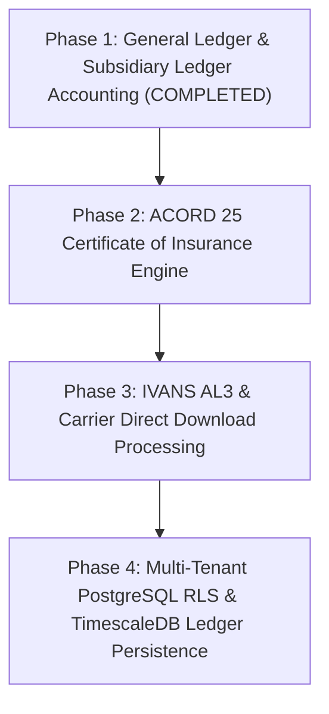

# Enterprise Parity Strategic Roadmap

This document outlines the multi-phase engineering roadmap for **CoreAMS** (`ams-proto`), establishing feature parity with enterprise Agency Management Systems and modern InsurTech platforms.

---

## 🗺 Strategic Roadmap Overview

---

## 📌 Phase Summary & Status

| Phase | Core Focus | Target Feature Parity | Status | Deliverables / Highlights |
| :--- | :--- | :--- | :---: | :--- |
| **Phase 1** | **General Ledger & Accounting** | Enterprise GL & Invoicing | **COMPLETED** | Double-entry GL engine, Chart of Accounts, Agency Bill invoicing (85/15 split), Trust Cash segregation (`1010`), Trial Balance API, and interactive workbench GUI. |
| **Phase 2** | **Certificate Management** | Enterprise COI & Certificates | **UPCOMING** | ACORD 25 Certificate of Liability Insurance generator, holder tracking database, and policy endorsement management. |
| **Phase 3** | **Carrier Download Processing** | IVANS / ACORD eDocs & AL3 Sync | **PLANNED** | Automated IVANS download intake, ACORD AL3 binary parser, policy renewal auto-reconciliation, direct bill statement posting. |
| **Phase 4** | **Database Persistence & RLS** | Enterprise SaaS Multi-Tenancy | **PLANNED** | Migration from in-memory seed store to PostgreSQL with Row-Level Security (RLS), multi-agency tenant isolation, and TimescaleDB hypertable transaction auditing. |

---

## 📑 Detailed Phase Specifications

### ✅ Phase 1: General Ledger & Subsidiary Ledger Accounting (Completed)
- **Double-Entry Enforcement**: Enforces `Debit === Credit` equality across all posted journal entries.
- **Chart of Accounts (COA)**: Standardized accounts including Operating Cash (`1000`), Fiduciary Trust Cash (`1010`), Accounts Receivable (`1200`), Carrier Payables (`2000`), and Commission Revenue (`4000`).
- **Fiduciary Trust Segregation**: Insured premium payments route directly to Fiduciary Trust Cash (`1010`) to comply with insurance regulatory mandates.
- **Agency Bill Invoicing**: Auto-calculates 85% Net Carrier Payable and 15% Agency Commission Revenue upon policy issuance.
- **Interactive Workbench GUI**: Added dedicated **General Ledger & Accounting** tab to `public/index.html` with real-time financial metrics and payment modals.

---

### ⏳ Phase 2: ACORD 25 Certificate of Insurance Engine (Upcoming)
- **ACORD 25 Rendering**: PDF and dynamic HTML generation for Certificate of Liability Insurance.
- **Certificate Holder Database**: Track certificate holders, special wording requirements, and additional insured endorsements.
- **Mass Issuance & Distribution**: Bulk certificate generation and carrier notification triggers.

---

### ⏳ Phase 3: IVANS AL3 & Carrier Direct Download Processing (Planned)
- **IVANS Exchange Connectors**: Intake automated carrier download packages.
- **ACORD AL3 Parser**: Decode legacy binary AL3 files into canonical policy objects.
- **Auto-Reconciliation Engine**: Match carrier policy transactions against existing CoreAMS customer policies.

---

### ⏳ Phase 4: Multi-Tenant PostgreSQL RLS & TimescaleDB Persistence (Planned)
- **PostgreSQL Database Schema**: Migrate in-memory seed store to relational DDL schemas with foreign key integrity.
- **Row-Level Security (RLS)**: Enforce tenant policy isolation across acquired agency branches.
- **TimescaleDB Ledger Audit**: Immutable time-series audit trail for financial transactions and legacy data migration crosswalks.
