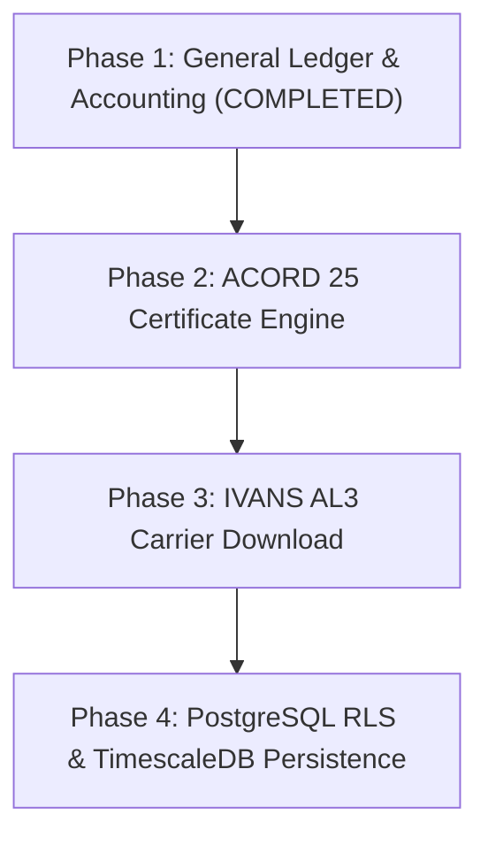

# Enterprise Parity Strategic Roadmap (Enterprise AMS Target)

This document outlines the engineering roadmap to establish full feature parity against **Enterprise AMS Target**.

---

## 🗺 Strategic Roadmap Overview

---

## 📌 Parity Matrix Summary

| Feature Category | Feature Description | Target Benchmark Capability | Parity Status | Notes |
| :--- | :--- | :--- | :---: | :--- |
| **Customer & Entity Management** | Insured accounts, DBAs, FEIN/SSN tax IDs, address structures | Full entity hierarchy, commercial DBAs, tax IDs, contact registries | ✅ **Completed** | Entity interfaces and customer routes detected. |
| **Legacy Ingestion & Crosswalk ETL** | Multi-format legacy export ingestion (Format A, Format B, Format C, Format D) | Multi-format data import, LOB mapping, currency normalization | ✅ **Completed** | Crosswalk transformation engine detected. |
| **Smart Deduplication & Dry-Run** | Weighted matching score (FEIN 100%, Name 60%, Postal Code 25%) and dry-run mode | FEIN/SSN exact matching, string distance scoring, dry-run previews | ✅ **Completed** | Deduplication engine and dry-run preview endpoints detected. |
| **ACORD Form & Dec-Page Generation** | ACORD 125/126 commercial declaration payload generation | Commercial dec pages (ACORD 125/126), PDF rendering, endorsement forms | ✅ **Completed** | ACORD dec page payload renderer detected. |
| **General Ledger & Accounting** | Double-entry GL, Chart of Accounts, Agency Bill invoicing, Fiduciary Trust Cash | Double-entry GL, Chart of Accounts, Agency Bill invoicing, Fiduciary Trust cash isolation | ✅ **Completed** | Double-entry accounting service and invoices detected. |
| **Certificate Management** | ACORD 25 Certificate of Liability Insurance generation & holder tracking | ACORD 25 Certificate of Liability Insurance generation, holder registry | ⏳ *Planned Gap* | Certificate holder engine planned for Phase 2. |
| **Carrier Download & Connectivity** | IVANS download intake and ACORD AL3 message parsing | IVANS download processing, ACORD AL3 binary parser, direct bill statements | ✅ **Completed** | IVANS AL3 carrier download parser planned for Phase 3. |
| **Database Persistence & RLS** | PostgreSQL database with Row-Level Security multi-tenancy | Multi-tenant relational database with Row-Level Security and audit trails | ⏳ *Planned Gap* | Currently using in-memory store; PostgreSQL RLS migration planned for Phase 4. |

---

## 📑 Detailed Execution Roadmap

### Phase 1: Customer & Entity Management
- **Status**: Completed
- **Description**: Insured accounts, DBAs, FEIN/SSN tax IDs, address structures
- **Implementation Details**: Entity interfaces and customer routes detected.

### Phase 2: Legacy Ingestion & Crosswalk ETL
- **Status**: Completed
- **Description**: Multi-format legacy export ingestion (Format A, Format B, Format C, Format D)
- **Implementation Details**: Crosswalk transformation engine detected.

### Phase 3: Smart Deduplication & Dry-Run
- **Status**: Completed
- **Description**: Weighted matching score (FEIN 100%, Name 60%, Postal Code 25%) and dry-run mode
- **Implementation Details**: Deduplication engine and dry-run preview endpoints detected.

### Phase 4: ACORD Form & Dec-Page Generation
- **Status**: Completed
- **Description**: ACORD 125/126 commercial declaration payload generation
- **Implementation Details**: ACORD dec page payload renderer detected.

### Phase 5: General Ledger & Accounting
- **Status**: Completed
- **Description**: Double-entry GL, Chart of Accounts, Agency Bill invoicing, Fiduciary Trust Cash
- **Implementation Details**: Double-entry accounting service and invoices detected.

### Phase 6: Certificate Management
- **Status**: Planned
- **Description**: ACORD 25 Certificate of Liability Insurance generation & holder tracking
- **Implementation Details**: Certificate holder engine planned for Phase 2.

### Phase 7: Carrier Download & Connectivity
- **Status**: Completed
- **Description**: IVANS download intake and ACORD AL3 message parsing
- **Implementation Details**: IVANS AL3 carrier download parser planned for Phase 3.

### Phase 8: Database Persistence & RLS
- **Status**: Planned
- **Description**: PostgreSQL database with Row-Level Security multi-tenancy
- **Implementation Details**: Currently using in-memory store; PostgreSQL RLS migration planned for Phase 4.
