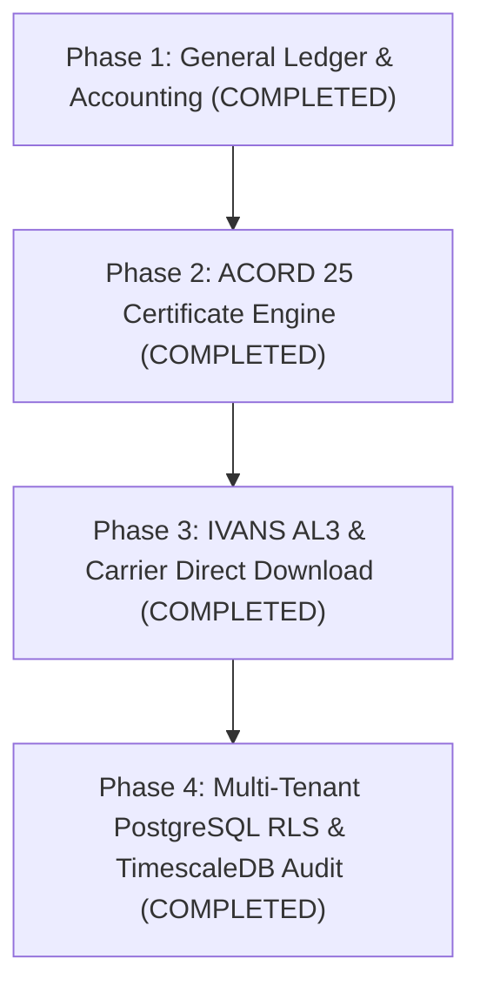

# Enterprise Parity Strategic Roadmap

This document outlines the multi-phase engineering roadmap for **CoreAMS** (`ams-proto`), establishing feature parity with enterprise Agency Management Systems and modern InsurTech platforms.

---

## 🗺 Strategic Roadmap Overview

---

## 📌 Phase Summary & Status

| Phase | Core Focus | Target Feature Parity | Status | Deliverables / Highlights |
| :--- | :--- | :--- | :---: | :--- |
| **Phase 1** | **General Ledger & Accounting** | Enterprise GL & Invoicing | **COMPLETED** | Double-entry GL engine, Chart of Accounts, Agency Bill invoicing (85/15 split), Trust Cash segregation (`1010`), Trial Balance API, and interactive workbench GUI. |
| **Phase 2** | **Certificate Management** | Enterprise COI & Certificates | **COMPLETED** | ACORD 25 Certificate of Liability Insurance generator, Insurers A-E slotting engine, Certificate Holder database, high-fidelity printable HTML renderer, mass bulk issuance API, and workbench GUI tab. |
| **Phase 3** | **Carrier Download Processing** | IVANS / ACORD eDocs & AL3 Sync | **COMPLETED** | Automated IVANS download intake, ACORD AL3 binary/fixed-width parser (`2BOS`, `2PRT`, `3CVI`, `3TRG`, `2EOS`), policy renewal auto-reconciliation engine, and direct bill commission auto-posting to GL. |
| **Phase 4** | **Database Persistence & RLS** | Enterprise SaaS Multi-Tenancy | **COMPLETED** | PostgreSQL relational DDL (`schema.sql`), Row-Level Security policies (`rls_policies.sql`), TimescaleDB hypertable audit ledger (`timescaledb_ledger.sql`), Express tenant middleware, multi-agency context switcher, and expanded test suite. |

---

## 📑 Detailed Phase Specifications

### ✅ Phase 1: General Ledger & Subsidiary Ledger Accounting (Completed)
- **Double-Entry Enforcement**: Enforces `Debit === Credit` equality across all posted journal entries.
- **Chart of Accounts (COA)**: Standardized accounts including Operating Cash (`1000`), Fiduciary Trust Cash (`1010`), Accounts Receivable (`1200`), Carrier Payables (`2000`), and Commission Revenue (`4000`).
- **Fiduciary Trust Segregation**: Insured premium payments route directly to Fiduciary Trust Cash (`1010`) to comply with insurance regulatory mandates.
- **Agency Bill Invoicing**: Auto-calculates 85% Net Carrier Payable and 15% Agency Commission Revenue upon policy issuance.
- **Interactive Workbench GUI**: Added dedicated **General Ledger & Accounting** tab to `public/index.html` with real-time financial metrics and payment modals.

---

### ✅ Phase 2: ACORD 25 Certificate of Insurance Engine (Completed)
- **ACORD 25 Rendering**: High-fidelity, print-styled HTML view matching official ACORD 25 Certificate of Liability Insurance grid specifications.
- **Insurers A-E Carrier Slotting**: Automatic extraction of active policies (GL, Auto, Workers Comp, Umbrella) and dynamic mapping to Insurers A through E slots.
- **Certificate Holder Database**: First-class Certificate Holder entity store supporting custom wording, attention contacts, and delivery preferences.
- **Mass Bulk Issuance**: Batch COI generation endpoint (`POST /api/v1/certificates/bulk-issue`) for project annual renewals across multiple holders.
- **Interactive Workbench GUI**: Dedicated **Certificate Management (ACORD 25)** tab in `public/index.html` with metrics, certificate tables, holder directory, and form triggers.

---

### ✅ Phase 3: IVANS AL3 & Carrier Direct Download Processing (Completed)
- **ACORD AL3 Parser**: Binary & fixed-width parsing for `2BOS` Group Header, `2PRT` Policy Header, `3CVI` Coverages, `3BTH`/`3TRG` Transaction Details, and `2EOS` Trailer.
- **Auto-Reconciliation Engine**: Automatic matching against existing policies by Policy Number, Carrier Code, Insured FEIN/SSN, Name, and Effective Date.
- **Direct Bill GL Commission Auto-Posting**: Automatic posting of direct bill commission revenue (`4000`), cash receipts (`1000`), and carrier net payables (`2000`) directly to the General Ledger upon batch reconciliation.
- **Carrier Download Workbench UI**: Added interactive **Carrier Download (AL3 / RLS)** tab with AL3 raw stream simulator, download batch ledger table, and GL commission posting triggers.

---

### ✅ Phase 4: Multi-Tenant PostgreSQL RLS & TimescaleDB Persistence (Completed)
- **PostgreSQL Database Schema (`schema.sql`)**: Relational DDL for core domain tables (`tenants`, `customers`, `policies`, `carriers`, `download_batches`, `download_transactions`, `journal_entries`, `certificate_holders`, `certificates`) with foreign keys and UUID primary keys.
- **Row-Level Security (`rls_policies.sql`)**: Strict tenant data isolation policies (`USING (tenant_id = current_setting('app.current_tenant_id'))`) protecting multi-agency data boundaries.
- **TimescaleDB Hypertable Audit Ledger (`timescaledb_ledger.sql`)**: Immutable time-series audit hypertable partitioned by 1-day time chunks for financial transaction auditing and legacy migration crosswalk tracking.
- **Multi-Tenant Middleware & UI Switcher**: Express middleware (`tenant.middleware.ts`) and active Tenant Switcher in `public/index.html` (`tenant-001` - Midwest Commercial Agency vs `tenant-002` - Coastal Property Risk).
